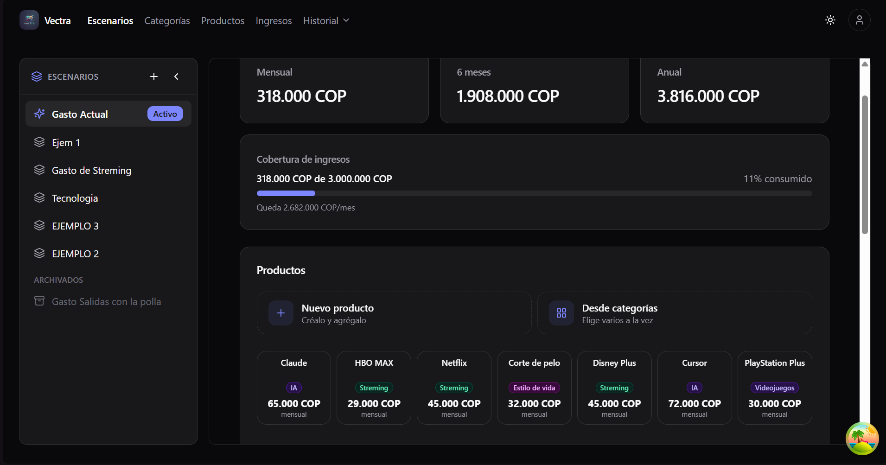

# Vectra

<div align="center">
  
</div>

**Vectra is a personal financial scenario simulator designed to help people model, explore, and compare financial decisions before making them.**

Instead of focusing on manually recording every transaction, Vectra focuses on answering questions such as:

- _What happens if I add this expense?_
- _How much will this scenario cost over time?_
- _What happens if I combine these products and income sources?_
- _How does one financial scenario compare to another?_

Vectra allows users to build financial scenarios using reusable products, categories, and income sources, then analyze their projected financial impact.


---

## Table of contents

- [About](#about)
- [Project status](#project-status)
- [Core concepts](#core-concepts)
- [Features](#features)
- [Tech stack](#tech-stack)
- [Project structure](#project-structure)
- [Documentation](#documentation)
- [Development](#development)
- [Contributing](#contributing)
- [License](#license)

## About

Traditional personal finance applications tend to focus on **tracking the past**: recording transactions, managing accounts, and categorizing expenses.

Vectra takes a different approach.

It focuses on **modeling the future**.

The core idea is to create financial scenarios by combining reusable expenses and income sources, organizing them into categories, and projecting their financial impact over different time periods.

This makes Vectra less of a traditional expense tracker and more of a **financial decision-making and simulation tool**.

## Project status

**Active development.**

The core application is functional and the product has evolved from its original concept as a traditional personal finance tracker into a scenario-based financial simulator.

Current development is focused on:

- UI/UX refinement
- Responsive design
- Visual consistency
- Scenario analysis and comparison
- Product presentation and landing page
- Production infrastructure and deployment

## Core concepts

### Scenarios

Scenarios are the central concept of Vectra.

A scenario represents a possible financial situation and is composed of expenses and income sources. Users can create different scenarios to explore how their financial situation changes under different assumptions.

### Products

Products represent reusable expenses such as subscriptions, services, purchases, or other recurring financial commitments.

Products can belong to categories and can be reused across multiple scenarios.

### Categories

Categories organize related products and provide an aggregated view of their financial impact.

For example:

- AI
- Lifestyle
- Entertainment
- Education
- Transportation

### Income

Income sources represent money coming into a scenario, such as salary, freelance income, or other recurring sources.

### Projections

Vectra calculates financial projections across different time horizons, including:

- Monthly
- 6 months
- Annual

This allows users to understand the financial impact of their decisions over time.

---

## Features

### Scenario modeling

- Create and manage financial scenarios.
- Add products and income sources to scenarios.
- Reuse products and income across multiple scenarios.
- View projected financial impact.
- Track which scenarios use a particular product or income source.
- Support scenario composition and synchronization.

### Products

- Create and organize financial products.
- Assign products to categories.
- Define amount and frequency.
- View monthly, 6-month, and annual projections.
- See which scenarios use a product.
- Archive, edit, and delete products.

### Categories

- Create custom categories.
- Organize products by category.
- View category-level financial projections.
- View products belonging to a category.
- Use category-specific visual identities.

### Income

- Create and manage income sources.
- Define amount and frequency.
- View financial projections.
- See which scenarios use an income source.
- Archive, edit, and delete income sources.

---

## Tech stack

| Layer    | Technologies                                                                                                                                                 |
| -------- | ------------------------------------------------------------------------------------------------------------------------------------------------------------ |
| Frontend | React 19, TypeScript, Vite, Tailwind CSS v4, shadcn/ui, React Router v7, TanStack Query, React Hook Form, Zod, Framer Motion, Recharts, Lucide React, Sonner |
| Backend  | Fastify, TypeScript, Prisma, PostgreSQL, JWT + Refresh Tokens, bcrypt, Zod                                                                                   |
| Monorepo | pnpm workspaces, Turborepo                                                                                                                                   |
| Testing  | Vitest, Testing Library, Supertest                                                                                                                           |
| Tooling  | ESLint, Prettier, Husky, lint-staged                                                                                                                         |
| API      | OpenAPI / Swagger                                                                                                                                            |

The frontend and backend are organized as feature-based applications inside a pnpm monorepo.

---

## Project structure

```text
vectra/
├── apps/
│   ├── api/          # Fastify backend
│   └── web/          # React frontend
├── packages/
│   ├── types/        # Shared TypeScript types and schemas
│   ├── ui/           # Shared UI components
│   ├── utils/        # Shared utilities
│   └── config/       # Shared configuration
├── docs/             # Product and architecture documentation
├── .claude/          # AI-assisted development context
├── package.json
├── pnpm-workspace.yaml
└── turbo.json
```

---

## Documentation

- [`docs/README.md`](docs/README.md) — documentation index.
- [`docs/product/vision.md`](docs/product/vision.md) — product vision and target user.
- [`docs/product/roadmap.md`](docs/product/roadmap.md) — development roadmap.
- [`docs/architecture/overview.md`](docs/architecture/overview.md) — architecture principles.
- [`docs/architecture/data-model.md`](docs/architecture/data-model.md) — domain entities and relationships.
- [`docs/decisions/`](docs/decisions/) — Architecture Decision Records (ADRs).
- [`docs/glossary.md`](docs/glossary.md) — domain terminology.
- [`.claude/CLAUDE.md`](.claude/CLAUDE.md) — project context and AI-assisted development rules.

---

## Development

Install dependencies:

```bash
pnpm install
```

Start the frontend and backend:

```bash
pnpm dev
```

The applications can also be started independently:

```bash
cd apps/web
pnpm dev
```

```bash
cd apps/api
pnpm dev
```

### Main applications

- Frontend: `apps/web`
- Backend: `apps/api`

---

## Contributing

Vectra is currently a solo portfolio project and is not open for external contributions.

---

## License

[MIT](LICENSE)
